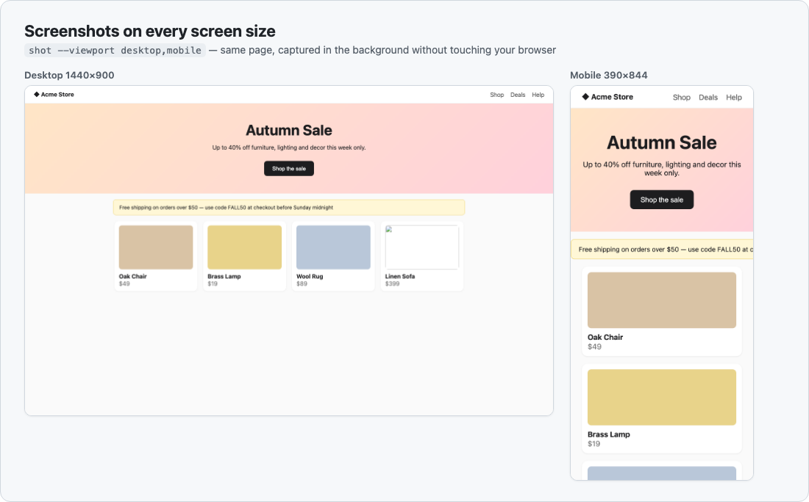
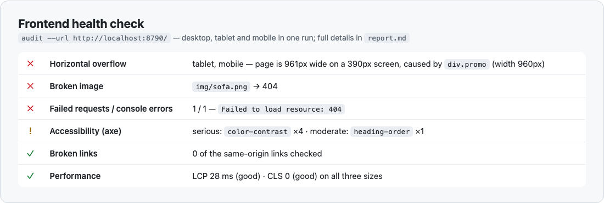
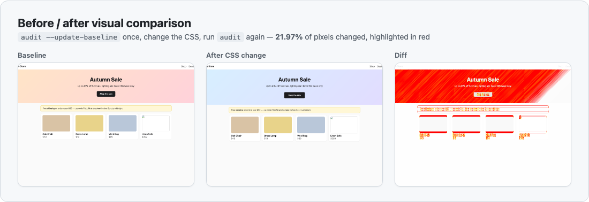

# claude-skill-playwright-browser

**English** | [繁體中文](README.zh-TW.md)

[](LICENSE)
[](https://github.com/AndyShiu/claude-skill-playwright-browser/releases)


Gives [Claude Code](https://claude.com/claude-code) a **browser that runs in the background**. Ask in plain language — "screenshot the homepage on mobile", "why does the Submit button do nothing on this page?", "health-check the checkout page" — and Claude opens a browser, clicks around, takes screenshots, runs checks, and hands you the results and files. It never touches the browser you're using, and it works in any project (frontend, backend, even non-Node projects).

---

## What it does

| Feature | Details |
|---|---|
| 📸 **Screenshots** | Desktop / tablet / mobile, full page or a single element, many pages in one batch |
| 🩺 **Frontend health check** | Console errors, failed API calls (4xx/5xx), broken images, broken links, mobile layout overflow (and which element causes it), accessibility issues (axe), performance (LCP / CLS) |
| 🔍 **Visual comparison** | Save a baseline before a CSS change, compare afterwards, get a diff image with changes highlighted in red |
| 🧭 **UI flows** | Log in, click through menus, fill forms, page through lists, assert results — with a screenshot at each step and an automatic screenshot on failure |
| 🔐 **Sites that need login** | You log in once yourself; Claude then reuses that session in the background (your password is never stored) |
| 🧪 **Real tests** | When you want it, turn a flow into a Playwright Test in your project and run it in CI |

### See it in action







<sub>All images were produced by this skill against a small demo site.</sub>

## Examples

Just talk to Claude — no need to mention "Playwright":

```
Take mobile and desktop screenshots of the homepage at localhost:5173
A customer says our site scrolls sideways on iPhone — find the element that's too wide
Health-check the new checkout page before we ship it
I changed the header CSS — compare before and after
On the admin "Orders" page, does going to page 2 actually load different data?
This issue says "Submit" does nothing — reproduce it on dev and capture screenshots
Screenshot every page in the admin menu and save them to my Desktop
```

**Claude sticks to what you asked**: ask for a screenshot and you get a screenshot; ask about one bug and it deals with that bug. A full check with a list of recommendations only happens when you ask for a review or a health check.

### Claude in Chrome or this skill?

| Better with Claude in Chrome | Better with this skill |
|---|---|
| Uses the tab **you have open right now**, in your logged-in browser | Runs **in the background**, doesn't touch your browser |
| You want to **watch it work** | Must be **repeatable** with consistent results |
| A quick one-off look | Several sizes or many pages **in one batch** |
| | Health checks, reports, before/after comparisons, tests |

When both would work, Claude asks which one you prefer and suggests one.

---

## Install

**Requirements**: Claude Code, Node.js 18+ (`node -v`), macOS / Linux / Windows, about 150 MB of disk for Chromium.

**1. Clone into a skills directory** (the folder must be named `playwright-browser`)

```bash
# Just for you, available in every project
git clone https://github.com/AndyShiu/claude-skill-playwright-browser.git ~/.claude/skills/playwright-browser

# Or for a single project (commit it with the project to share with your team)
git clone https://github.com/AndyShiu/claude-skill-playwright-browser.git <project>/.claude/skills/playwright-browser
```

On Windows the personal location is `%USERPROFILE%\.claude\skills\playwright-browser`.

> **Windows / Git Bash**: Claude Code on Windows uses Git Bash by default, which rewrites arguments that start with `/` into Windows paths (`--until-url /dashboard` becomes `C:/Program Files/Git/dashboard`). The skill undoes this for its own options automatically. If you run other commands by hand and hit the same thing, drop the leading `/` (e.g. `--until-url dashboard`), prefix the command with `MSYS_NO_PATHCONV=1`, or use PowerShell / cmd.

**2. That's it.** The first time Claude uses the skill it notices the runtime isn't installed, tells you, and runs the one-time setup. To install up front instead:

```bash
node ~/.claude/skills/playwright-browser/scripts/setup.mjs                  # Chromium only
node ~/.claude/skills/playwright-browser/scripts/setup.mjs firefox webkit   # also Firefox and WebKit (Safari's engine)
```

npm packages go into `node_modules/` inside the skill folder (git-ignored); browsers go into Playwright's shared cache, so every project and every copy of the skill shares one download. **Your projects are never touched.**

---

## Sites that need login

1. Tell Claude you want to work on a site that needs login — it opens a browser window for you
2. **Log in yourself** in that window (only you type your credentials; they're never stored)
3. Close the window when you're done — or Claude sets it to save and close automatically once you reach a given page

From then on Claude can use that session in the background. After every run, any tokens the site refreshed are saved back, so **a session you keep using stays logged in**. If it sits idle past the site's login lifetime, Claude detects the redirect to the login page and asks you to log in again — it will never hand you a login screen as the result.

---

## Where files go

The skill folder contains **no personal data**, so it's safe to share or commit.

| What | Where | Notes |
|---|---|---|
| Login sessions | `~/.claude/playwright/sessions/<project>/` | Contain cookies / tokens, readable only by you. **Never commit or share them** |
| Visual baselines | `~/.claude/playwright/baselines/<project>/` | Reference screenshots for before/after comparisons |
| Screenshots & reports | `claude-playwright/` in the system temp dir | **Deleted after 7 days**; Claude asks where to save anything you want to keep |

---

## Token usage

Rough extra cost of one use inside an existing conversation:

| Task | Approx. tokens |
|---|---|
| One screenshot | 5k–7k |
| Three screen sizes | 8k–10k |
| Full health check of one page | 12k–18k |
| Investigating one issue / walking through a flow | 20k–40k |
| Batch screenshots of many pages | 25k–40k (samples a few instead of opening every image) |

The main cost is *looking* at screenshots (~1.5k–2k each). Asking only for the sizes you need, and giving a URL instead of having Claude find the page, saves a lot.

---

## Troubleshooting

| Symptom | What to do |
|---|---|
| The screenshot shows a login page | The session expired — ask Claude to log in again |
| The screenshot shows a loading spinner | Ask Claude to wait for specific content before capturing (it uses `--wait-for`) |
| Certificate error on an intranet site | Self-signed certificate — once you've confirmed the host is trusted, ask Claude to add `--insecure` |
| Can't reach `localhost` | The dev server isn't running — Claude will tell you and can start it |
| A button "does nothing" but actually shows a confirm dialog | Browser dialogs are dismissed by default; Claude knows to accept them when needed |
| Need to test Safari compatibility | Run `setup.mjs webkit` to install WebKit |

---

## Manual use (advanced)

You normally don't need this — Claude calls it for you. To run it yourself:

```bash
PW="$HOME/.claude/skills/playwright-browser/scripts/pw.mjs"

node "$PW" inspect --url https://example.com --click "Pricing"        # text outline of the page
node "$PW" shot    --url https://example.com --viewport desktop,mobile --full
node "$PW" audit   --url https://example.com                           # full health check, writes report.md
node "$PW" run     --script flow.mjs --url https://example.com         # custom flow
node "$PW" login   --session admin --url https://example.com/login --until-url dashboard   # log in; saves once you reach dashboard
node "$PW" sessions                                                    # list saved sessions
node "$PW" clean   --days 0                                            # delete all temp screenshots
```

Each command prints one line of JSON. See [`SKILL.md`](SKILL.md) for every option.

---

## Update & uninstall

- **Update**: run `git pull` in the skill folder; if `package.json` changed, run `node scripts/setup.mjs` again
- **Uninstall**: delete the skill folder and `~/.claude/playwright/`. For the browser cache, run `npx playwright uninstall --all` in the skill folder before deleting it, or remove `~/Library/Caches/ms-playwright` (macOS), `~/.cache/ms-playwright` (Linux) or `%LOCALAPPDATA%\ms-playwright` (Windows)

## Repository layout

```
SKILL.md                     Instructions Claude reads (when and how to use the skill)
scripts/pw.mjs               The CLI: inspect / shot / audit / run / login / diff / sessions / clean
scripts/setup.mjs            Cross-platform one-time setup
references/analysis.md       How to read audit results, thresholds, tracing issues to code
references/project-tests.md  Turning flows into real project tests (Playwright Test + CI)
docs/images/                 README screenshots (made with this skill)
CHANGELOG.md                 Release notes
```

## License

[MIT](LICENSE) © AndyShiu · See [CHANGELOG.md](CHANGELOG.md) for release notes.
